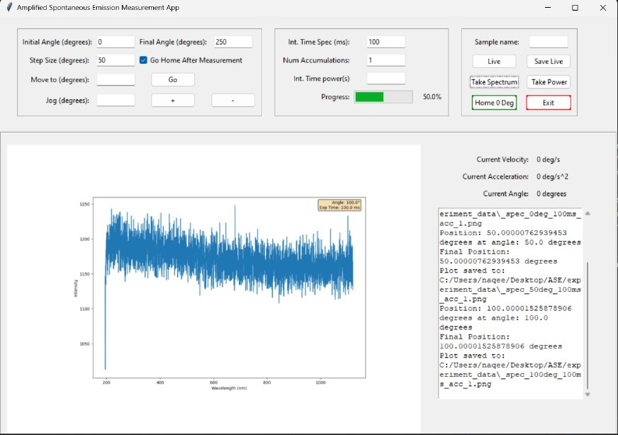

# Amplified spontaneous emission (ASE) Automation Setup Guide

## Introduction
Welcome to the Amplified spontaneous emission (ASE) Automation Setup Guide. This guide is designed to help you set up a GUI application using Tkinter for experiment automation.

## Application Features

1. **Intuitive Angle Adjustment**: Easily jog angles up or down with precision, tailored to the size of the angle for seamless navigation.

2. **Live Spectrum Visualization**: Instantly view live spectrum data at any angle, providing real-time insights. Save live spectrum snapshots to a specified location for future reference.

3. **Automated Instrument Control**:
   - **Thorlabs K10CR1 Rotation Stage Integration**: Effortlessly control rotation stage settings, including initial and final angles, and step size.
   - **Ocean Optics Spectrometer**: Seamlessly capture spectra data and display it on the GUI. Save spectrum data to a user-defined directory for analysis.
   - **Power Meter Integration**: Control power meter settings to capture power versus angle data. Plot the results directly on the GUI and save the data for further analysis.

4. **Sample Naming**: Conveniently assign names to your experiments for easy identification and organization.

5. **Progress Tracking**: Stay informed with a progress bar, indicating the status of ongoing operations for enhanced user experience.

6. **On-Screen Logging**: Access logs directly on the GUI interface, ensuring transparency and facilitating troubleshooting if needed.

## Hardware Requirements
- Thorlabs K10CR1 Rotation Stage
- Ocean Optics Spectrometer HR4000
- Starbright Power Meter

## Dwonload the Required Drivers

1. **Download APT Software for Thorlab K10CR1:**
   - Download and install the APT (Advanced Positioning Technology) software from [Thorlabs Software](https://www.thorlabs.com/software_pages/ViewSoftwarePage.cfm?Code=Motion_Control).

2. **Install Spectra Suite for Ocean Optics Spectrometer :**
   - Download and install [Spectra Suite](https://digital.lib.washington.edu/researchworks/bitstream/handle/1773/37113/Appendix%20D%20-%20HR4000.pdf?sequence=5) for Ocean Optics spectrometers.
   ###### Note: Do not plug in the Spectrometer untill you install the Spectra Suite.

3. **Install StarLab For StarbrightPower Meter**
   - Download and install [StarLab](https://www.ophiropt.com/en/g/starlab-for-usb) for Starbright Power Meter.

## Required Python version
- Python 3.9 or higher

## Required Packages
- matplotlib==3.5.2
- numpy==1.22.0
- pywin32==304
- qcodes_contrib_drivers==0.18.0
- seabreeze==2.4.0
###### Note: The required packages are already listed in the requirements.txt file.

## How to Run the Application

1. **Open Terminal:**
   - Open a terminal window on your computer.

2. **Navigate to the Application Folder:**
   - Use the `cd` command to navigate to the folder where your application is located.

3. **Install Required Packages:**
   - Type the following command and press Enter to install the required packages:
     ```
     pip install -r requirements.txt
     ```
4. **Run the Application:**
   - Type the following command and press Enter to run the application:
     ```
     click on ASE.bat
     ```
4. **GUI Interface:**
   - The GUI application will open, providing a user-friendly interface for experiment automation.

5. **Enter Required Fields:**
   - Enter the required parameters, such as the start angle, final angle, step size, exposure time, and the number of accumulations.



## Addtional Resoures

1. **Learn More About QCoDeS Contrib Drivers:**
   - [QCoDeS Contrib Drivers Documentation](https://qcodes.github.io/Qcodes_contrib_drivers/index.html).

2. **Explore Thorlabs K10CR1 Example:**
   - [Thorlabs K10CR1 Example](https://qcodes.github.io/Qcodes_contrib_drivers/examples/Thorlabs_K10CR1.html).

3. **Read Python Seabreeze Documentation:**
   - [Python Seabreeze Documentation](https://python-seabreeze.readthedocs.io/en/latest/).

## Known Issues
- Sometime Thorlab KC10CR1 rotation stage does not move to the Home (0 deg) angle. In this case, you need to restart the application and replug the wheel then try again.

